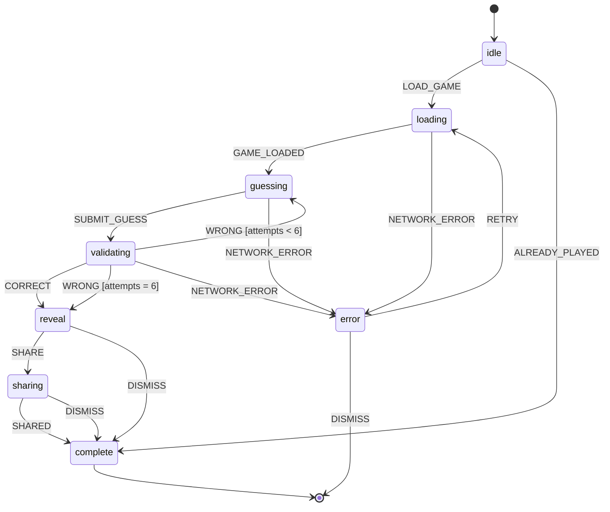

# Game State Machines

State diagrams for each game mode using XState v5 conventions. Guards and transitions are listed inline.

---

## Daily Frame — State Machine



### State Descriptions

| State | Description |
|-------|-------------|
| `idle` | Initial state. No game loaded. Checks for prior play on entry. |
| `loading` | Fetching today's daily game config and first frame URL from API. |
| `guessing` | Player is actively typing a guess. Frame + hints are displayed. |
| `validating` | Guess submitted to server. Awaiting validation response. |
| `reveal` | Answer revealed (either correct or max attempts reached). Score displayed. |
| `sharing` | Share sheet open. Emoji grid + score ready to copy/post. |
| `complete` | Terminal state. Game over. Leaderboard link shown. Next game countdown starts. |
| `error` | Network or server error. Retry available. |

### Guard Conditions

| Guard | Condition |
|-------|-----------|
| `attempts < 6` | `context.attemptsUsed < 6` — more guesses remaining, show next hint frame |
| `attempts = 6` | `context.attemptsUsed >= 6` — no guesses left, force reveal |

### Context Shape (XState)

```typescript
interface DailyFrameContext {
  gameId: string | null;
  dailyGameId: string | null;
  currentFrameUrl: string | null;
  attemptsUsed: number;        // 0–6
  maxAttempts: number;         // always 6 for Daily Frame
  guesses: GuessRecord[];      // history of submitted guesses
  score: number | null;
  won: boolean | null;
  shareHash: string | null;
  error: string | null;
}
```

### Events

| Event | Payload | From State |
|-------|---------|------------|
| `LOAD_GAME` | `{ mode, date }` | `idle` |
| `ALREADY_PLAYED` | `{ result: GameResult }` | `idle` |
| `GAME_LOADED` | `{ gameId, frameUrl, hintsAvailable }` | `loading` |
| `SUBMIT_GUESS` | `{ guess: string }` | `guessing` |
| `CORRECT` | `{ score, shareHash }` | `validating` |
| `WRONG` | `{ nextFrameUrl, attemptsLeft }` | `validating` |
| `SHARE` | — | `reveal` |
| `SHARED` | — | `sharing` |
| `DISMISS` | — | `reveal`, `sharing`, `error` |
| `RETRY` | — | `error` |
| `NETWORK_ERROR` | `{ message }` | `loading`, `guessing`, `validating` |

---

## Notes for Other Game Modes

All 12 game modes share the same outer shell (`idle → loading → guessing → complete`). Mode-specific differences:

| Mode | Key Difference |
|------|---------------|
| **Clip Guesser** | `guessing` state streams a 5-second video clip; no frame progression |
| **Pixel Reveal** | `guessing` state cycles through 8×8 → 16×16 → 32×32 → 64×64 → 128×128 → full on each wrong guess |
| **Year Guesser** | `guessing` accepts a numeric year input; no autocomplete |
| **View Count Blitz** | Timed sub-state inside `guessing`; auto-submit on timer expiry |
| **Timeline Sort** | `guessing` is drag-and-drop; single submission after ordering all clips |
| **Category Clash** | Multi-round; `reveal` loops back to `guessing` for each new round |
| **Streak** | Infinite rounds; `complete` only on first wrong answer |
| **Duel** | Two-player; `guessing` is synchronized via WebSocket; separate `waiting` state for matchmaking |
| **Fragment Match** | `guessing` shows one quadrant; hint reveals additional quadrants |
| **Sound Only** | `guessing` plays audio clip; no visual frame |
| **Channel Check** | `guessing` shows a video grid; player selects which belong to the target channel |
