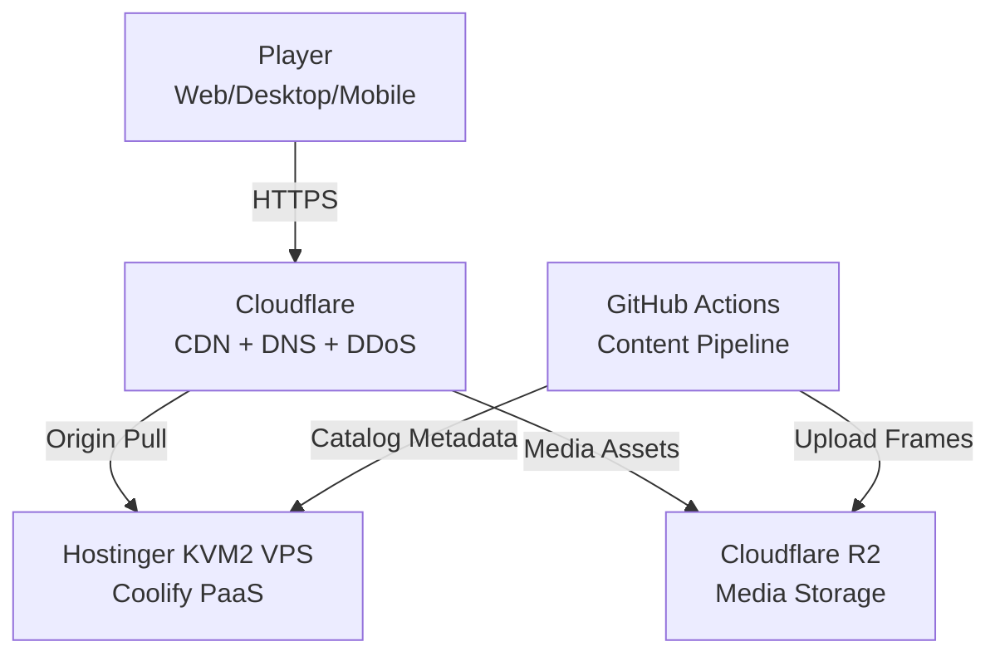
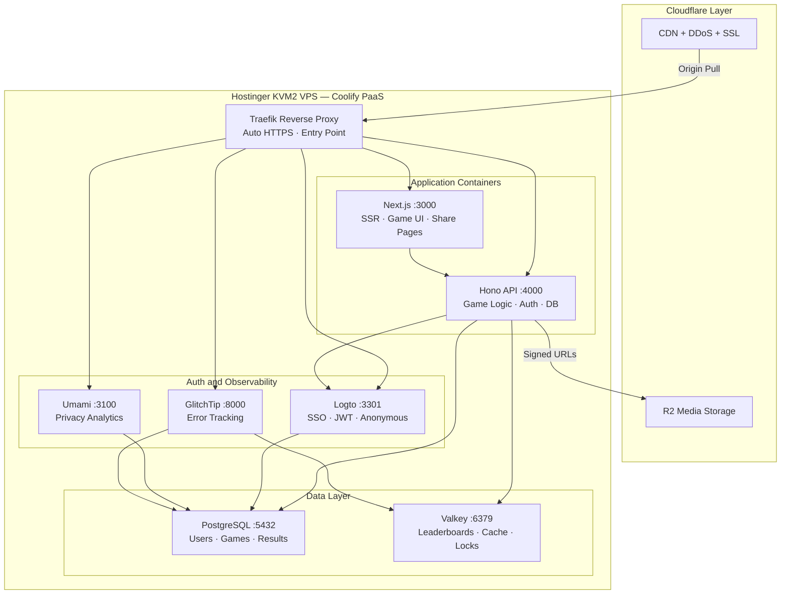
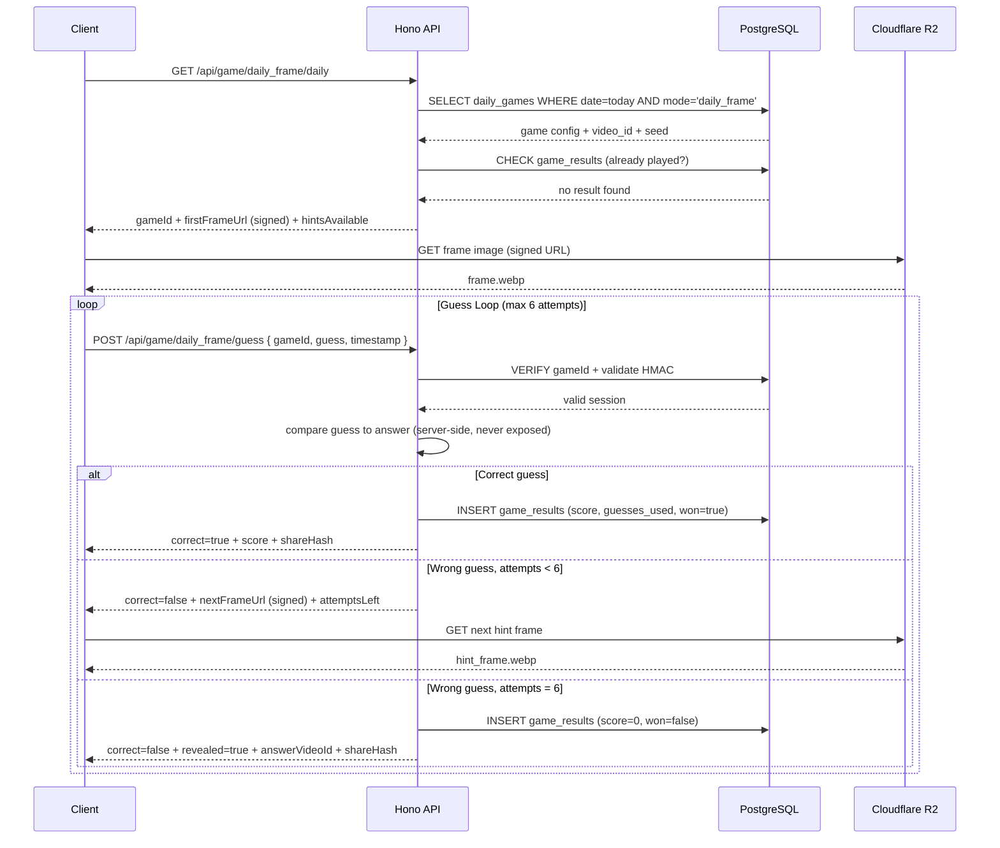
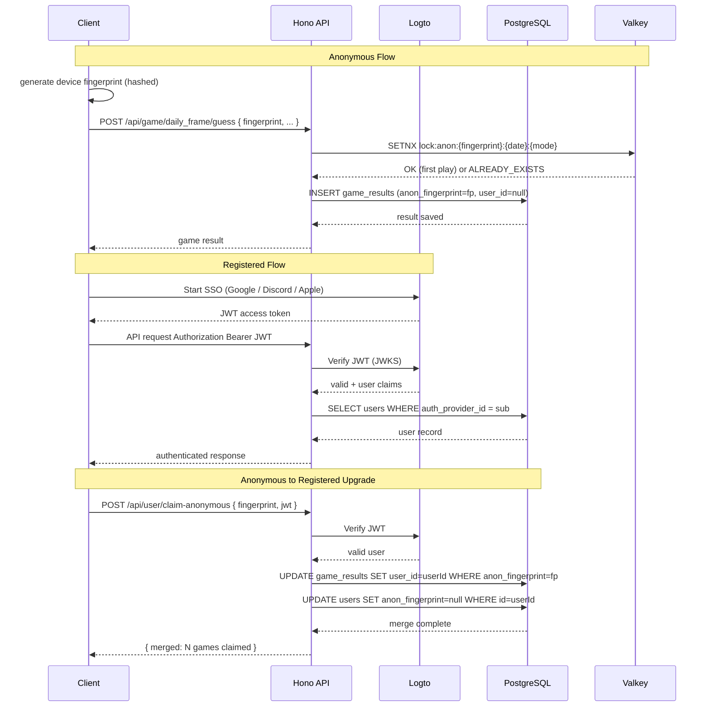
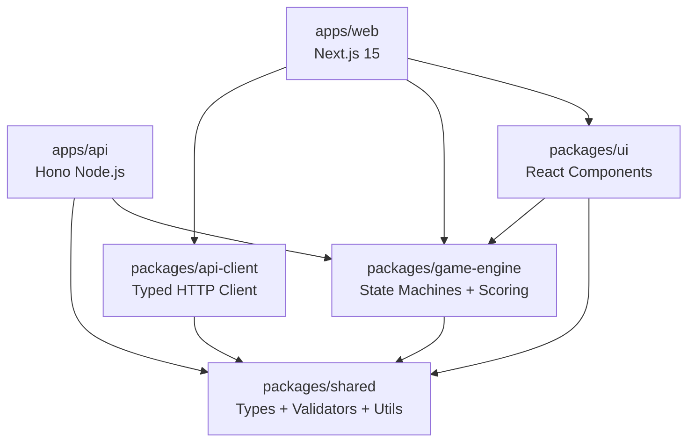

# System Architecture

## High-Level Overview

Framedle uses a **VPS-first hybrid architecture** for cost-effective, self-hosted deployment with cloud services used only where they provide clear advantages (CDN, media storage, CI/CD). Three domains: **Client Apps**, **Backend Services**, **Content Pipeline**.

> For cloud-only deployment, see migration path in [vps-deployment.md](vps-deployment.md).

```
┌──────────────────────────────────────────────────────────────────┐
│                        CLIENT APPS                                │
│                                                                    │
│  ┌────────────┐    ┌────────────────┐    ┌─────────────────────┐  │
│  │  Web App   │    │  Desktop App   │    │    Mobile Apps      │  │
│  │  Next.js   │    │  Tauri v2      │    │    Tauri v2         │  │
│  │  (SSR/SEO) │    │  (Win/Mac/Lin) │    │    (iOS/Android)    │  │
│  └─────┬──────┘    └───────┬────────┘    └──────────┬──────────┘  │
│        └───────────────────┼─────────────────────────┘             │
│                            │                                       │
│                   Shared: React 19 + TypeScript                    │
│                   packages/ui + packages/game-engine               │
└────────────────────────────┬───────────────────────────────────────┘
                             │
                        HTTPS / WS
                             │
┌────────────────────────────┴───────────────────────────────────────┐
│                  CLOUDFLARE (CDN / PROXY LAYER)                     │
│                                                                      │
│  DNS + CDN proxy + DDoS protection + SSL                            │
│  Cache: static assets, frame images, API responses                  │
│  R2: frame images, clips, audio, OG images (10 GB free, $0 egress) │
└────────────────────────────┬───────────────────────────────────────┘
                             │ Origin pull
┌────────────────────────────┴───────────────────────────────────────┐
│                   BACKEND SERVICES (Hostinger KVM2 VPS)             │
│                                                                      │
│  ┌─────────────────────────────────────────────────────────────┐    │
│  │  Hono (Node.js — api.framedle.wtf :4000)                    │    │
│  │                                                               │    │
│  │  /api/game/:mode/daily     → fetch today's challenge          │    │
│  │  /api/game/:mode/guess     → submit guess (server validates)  │    │
│  │  /api/leaderboard/:mode    → rankings (Valkey sorted sets)    │    │
│  │  /api/user/profile         → user data (Logto + PostgreSQL)   │    │
│  │  /api/share/:gameId        → dynamic OG image generation      │    │
│  │  /api/duel/match/:id       → WebSocket via ws + Valkey state  │    │
│  └──────┬────────────────┬────────────────┬─────────────────────┘    │
│         │                │                │                          │
│  ┌──────┴──────┐  ┌──────┴──────┐  ┌─────┴──────┐  ┌────────────┐  │
│  │   Logto     │  │ PostgreSQL  │  │  Valkey    │  │ CF R2      │  │
│  │   (Auth)    │  │  16 (VPS)   │  │  (VPS)     │  │ (Images)   │  │
│  │             │  │             │  │            │  │            │  │
│  │  SSO, JWT   │  │  Users,     │  │  Cache +   │  │  Frames,   │  │
│  │  Anonymous  │  │  Games,     │  │  Leaderb.  │  │  Clips,    │  │
│  │  → Upgrade  │  │  Frames,    │  │            │  │  Audio     │  │
│  │             │  │  Stats      │  │            │  │            │  │
│  └─────────────┘  └─────────────┘  └────────────┘  └────────────┘  │
└────────────────────────────────────────────────────────────────────┘
                             │
                      GitHub Actions
                        (Daily Cron)
                             │
┌────────────────────────────┴───────────────────────────────────────┐
│                       CONTENT PIPELINE                              │
│                                                                      │
│  ┌──────────┐   ┌──────────────┐   ┌──────────┐   ┌─────────────┐  │
│  │  Video   │──>│   yt-dlp     │──>│  ffmpeg  │──>│  Upload to  │  │
│  │  Lists   │   │  (metadata + │   │  (frames │   │  R2 +       │  │
│  │  (curate │   │   heatmap)   │   │  + crops │   │  PostgreSQL │  │
│  │   + API) │   │              │   │  + pixel)│   │  + Assign   │  │
│  └──────────┘   └──────────────┘   └──────────┘   │  game seeds │  │
│                                                     └─────────────┘  │
└──────────────────────────────────────────────────────────────────────┘
```

---

## Monorepo Structure

```
framedle/
├── apps/
│   ├── web/                    # Next.js 15 app
│   │   ├── app/                # App Router pages
│   │   ├── components/         # Web-specific components
│   │   └── next.config.ts
│   ├── desktop/                # Tauri v2 desktop
│   │   ├── src-tauri/          # Rust backend
│   │   └── src/                # React frontend (imports from packages/)
│   └── mobile/                 # Tauri v2 mobile
│       ├── src-tauri/
│       └── src/
├── packages/
│   ├── ui/                     # Shared React design system
│   │   ├── components/         # Button, Card, Modal, GameBoard, etc.
│   │   ├── hooks/              # useGame, useTimer, useShare, etc.
│   │   └── styles/             # Tailwind presets, animations
│   ├── game-engine/            # Pure TypeScript game logic
│   │   ├── modes/              # One file per game mode state machine
│   │   ├── scoring.ts          # Scoring calculations
│   │   ├── types.ts            # Shared types
│   │   └── daily-seed.ts       # Deterministic daily seed logic
│   ├── api-client/             # Typed HTTP client (generated from OpenAPI)
│   └── shared/                 # Constants, utils, validators
├── workers/
│   ├── api/                    # Main Hono API (Node.js on VPS)
│   └── og-image/               # Share image generator
├── pipeline/
│   ├── extract_frames.py       # Main extraction script
│   ├── extract_batch.py        # Batch processor
│   ├── curate.py               # Video list management
│   └── assign_games.py         # Assign content to future dates
├── docs/                       # This documentation
├── .github/workflows/          # CI/CD + daily pipeline
├── turbo.json                  # Turborepo config
└── package.json                # Root workspace
```

---

## API Design — Key Endpoints

### Game Endpoints

```
GET  /api/game/:mode/daily
     → Returns today's game for the mode
     → Includes initial frame URL(s), game ID, metadata
     → If user already played: returns their result

POST /api/game/:mode/guess
     Body: { gameId, guess, timestamp }
     → Validates guess server-side
     → Returns: correct/incorrect, next hint, score update
     → Writes result to DB on completion

GET  /api/game/:mode/result/:gameId
     → Full game result (after completion only)
     → Used for share page rendering
```

### Leaderboard Endpoints

```
GET  /api/leaderboard/:mode?period=daily|weekly|alltime&limit=100
     → Returns ranked list from Valkey sorted sets

GET  /api/leaderboard/:mode/me
     → Current user's rank + surrounding players

GET  /api/leaderboard/friends
     → Filtered to user's social connections
```

### User Endpoints

```
GET   /api/user/profile          → User profile + stats summary
PATCH /api/user/profile          → Update display name, avatar, country
GET   /api/user/stats            → Detailed play history + achievements
GET   /api/user/achievements     → Achievement list + progress
```

### Duel Endpoints

```
POST  /api/duel/queue            → Enter matchmaking queue
POST  /api/duel/invite           → Generate invite link
WS    /api/duel/match/:matchId   → WebSocket via ws library + Valkey-backed state
```

---

## OIDC Authentication Flow (Web — openid-client + H3 Sessions)

```
Browser                  Nuxt Server                  Logto
   │                          │                          │
   │── GET /api/auth/sign-in ─>│                          │
   │                          │── discovery(logtoEndpoint)─>│
   │                          │<─ OIDC config + JWKS ──────│
   │                          │                          │
   │                          │  generate PKCE + state   │
   │                          │  store in cookie session  │
   │<── 302 → Logto /auth ────│                          │
   │                          │                          │
   │──────────────── GET /auth?code_challenge=... ──────>│
   │<─────────────── 302 → /api/auth/callback?code=... ──│
   │                          │                          │
   │── GET /api/auth/callback ─>│                          │
   │                          │── token exchange (code) ─>│
   │                          │<─ access_token + id_token─│
   │                          │── verify PKCE state      │
   │                          │  store tokens in session │
   │<── 302 → / ─────────────│                          │
   │                          │                          │
   │── GET /api/auth/token ───>│                          │
   │                          │  read session cookie     │
   │<── { accessToken } ──────│  refresh if expired      │
   │                          │                          │
   │── API request + Bearer ──────────────────────────────────────>│ Hono API
   │                          │                          │  jose.jwtVerify()
   │<── API response ─────────────────────────────────────────────<│ via JWKS
```

## Authentication Flow

```
┌─────────────┐                          ┌─────────────┐
│   Client    │                          │    Logto    │
│             │──── 1. Start SSO ───────>│  (self-     │
│             │                          │   hosted)   │
│             │<── 2. JWT Token ─────────│             │
│             │                          │  Google,    │
│             │                          │  Discord,   │
│             │                          │  Apple...   │
│             │                          └─────────────┘
│             │
│             │──── 3. API Request ──────>┌─────────────┐
│             │     Authorization:        │  Hono API   │
│             │     Bearer <jwt>          │  (Node.js)  │
│             │                          │             │
│             │<── 5. Response ──────────│ 4. Verify   │
│             │                          │    JWT       │
│             │                          │    (standard)│
└─────────────┘                          └─────────────┘
```

### Anonymous → Registered Upgrade

1. Anonymous users get a **device fingerprint** (hashed, stored locally)
2. Game results stored locally (IndexedDB/SQLite) + server-side with fingerprint
3. When user registers, they **claim** their anonymous history via the fingerprint
4. This is a one-way merge — anonymous data gets linked to the new account

---

## Content Pipeline Detail

### R2 Storage Structure

```
r2://framedle-content/
├── frames/
│   └── {video_id}/
│       ├── f01.webp              # Full frame (1280px, quality 80)
│       ├── f01_thumb.webp        # Thumbnail (320px)
│       ├── f01_crop_25.webp      # Center 25% crop (for Daily Frame hint 1)
│       ├── f01_crop_50.webp      # Center 50% crop (for hint 2)
│       ├── f01_desat.webp        # Desaturated version
│       ├── f01_px8.webp          # 8×8 pixelated (Pixel Reveal)
│       ├── f01_px16.webp         # 16×16
│       ├── f01_px32.webp         # 32×32
│       ├── f01_px64.webp         # 64×64
│       ├── f01_px128.webp        # 128×128
│       ├── f01_frag_tl.webp      # Top-left quadrant (Fragment Match)
│       ├── f01_frag_tr.webp      # Top-right
│       ├── f01_frag_bl.webp      # Bottom-left
│       └── f01_frag_br.webp      # Bottom-right
├── clips/
│   └── {video_id}/
│       └── c01_5s.mp4            # 5-second clip (Clip Guesser)
├── audio/
│   └── {video_id}/
│       └── a01_5s.opus           # 5-second audio (Sound Only)
└── og/
    └── {gameId}.png              # Generated share images (cached)
```

### Image Processing Pipeline (ffmpeg commands)

```bash
# Full frame
ffmpeg -ss {ts} -i {url} -vframes 1 -vf "scale=1280:-1" -q:v 2 f01.webp

# Pixelated versions
ffmpeg -ss {ts} -i {url} -vframes 1 -vf "scale=8:8:flags=neighbor,scale=1280:720:flags=neighbor" f01_px8.webp

# Center crop (25%)
ffmpeg -ss {ts} -i {url} -vframes 1 -vf "crop=iw*0.5:ih*0.5:iw*0.25:ih*0.25,scale=1280:-1" f01_crop_25.webp

# Desaturated
ffmpeg -ss {ts} -i {url} -vframes 1 -vf "scale=1280:-1,hue=s=0" f01_desat.webp

# Fragment (top-left quadrant)
ffmpeg -ss {ts} -i {url} -vframes 1 -vf "crop=iw*0.5:ih*0.5:0:0,scale=640:-1" f01_frag_tl.webp

# Clip (5 seconds)
ffmpeg -ss {ts} -t 5 -i {url} -vf "scale=854:-1" -an -c:v libx264 -preset fast c01_5s.mp4

# Audio only (5 seconds)
ffmpeg -ss {ts} -t 5 -i {url} -vn -c:a libopus -b:a 96k a01_5s.opus
```

---

## Security & Anti-Cheat

1. **Server-authoritative**: answers never sent to client before game completion
2. **Signed URLs**: R2 frame URLs have 1-hour TTL signatures
3. **Request timing**: impossibly fast correct answers are flagged
4. **Game hash**: each session has a server-generated HMAC that must accompany submissions
5. **Rate limiting**: per-IP (anonymous) and per-user (authenticated) limits
6. **Daily lock**: completed games cannot be replayed (keyed by user+date+mode)
7. **Frame obfuscation**: frame URLs don't contain video IDs (mapped via DB lookup)

---

## Scalability

| Component | Strategy | Capacity |
|-----------|----------|----------|
| API | Hono on Node.js (VPS, 2 vCPU) | ~3,000–5,000 DAU |
| Database | PostgreSQL 16 (VPS, shared_buffers=384 MB) | ~3,000–5,000 DAU |
| Images | R2 + CF CDN (edge cached) | Unlimited |
| Leaderboard | Valkey sorted sets O(log N), 256 MB max | Millions of entries |
| Duels | ws library (per-match in-memory, Valkey-backed) | ~100 concurrent matches |
| Pipeline | GitHub Actions (6h limit) | 100+ videos/day |
| Upgrade path | KVM4 (4 vCPU / 16 GB) | ~10,000–15,000 DAU |

> See [vps-deployment.md](vps-deployment.md) for detailed RAM budgets, CPU bottleneck analysis, and the migration path to cloud services when VPS capacity is exceeded.

---

## Mermaid Diagrams

### C4 Context — System Overview



### C4 Container — VPS Services



### Game Lifecycle — Daily Frame Sequence



### Auth Flow — Anonymous and Registered



### Package Dependency Graph


